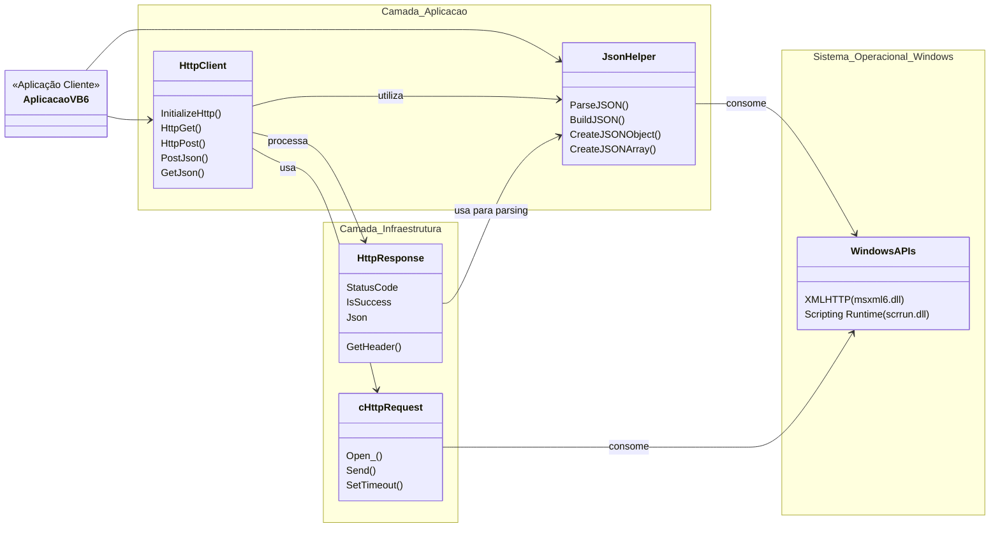
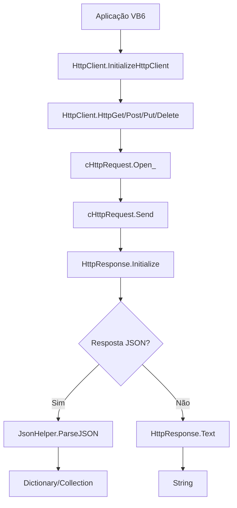

# Documentação Técnica - VB6 API Consumption

Esta documentação técnica aborda todos os aspectos do sistema de consumo de APIs REST em Visual Basic 6.0, focando nos módulos e classes core da biblioteca.

## 📚 Estrutura da Documentação

### 🏗️ Arquitetura e Componentes Core

- **[HttpClient Module](01-HttpClient-Module.md)** - Cliente HTTP principal com todos os métodos REST
- **[JsonHelper Module](02-JsonHelper-Module.md)** - Sistema completo de processamento JSON
- **[HttpResponse Class](03-HttpResponse-Class.md)** - Encapsulamento de respostas HTTP
- **[cHttpRequest Class](04-cHttpRequest-Class.md)** - Wrapper para XMLHTTP do Windows

### 📖 Guias de Uso Prático

- **[Guia de Inicialização](05-Guia-Inicializacao.md)** - Como configurar e inicializar o sistema
- **[Trabalhando com JSON](06-Trabalhando-JSON.md)** - Manipulação completa de dados JSON
- **[Requisições HTTP](07-Requisicoes-HTTP.md)** - Todos os métodos HTTP com exemplos
- **[Headers e Autenticação](08-Headers-Autenticacao.md)** - Sistema de headers e autenticação
- **[Troubleshooting](09-Troubleshooting.md)** - Problemas Comuns e Soluções

## 🚀 Início Rápido

Para começar rapidamente, consulte:

1. **[Guia de Inicialização](05-Guia-Inicializacao.md)** - Configuração básica
2. **[Requisições HTTP](07-Requisicoes-HTTP.md)** - Primeiras requisições

## 🏛️ Arquitetura Geral

<!-- TODO melhorar este trecho -->

## 📊 Fluxo de Funcionamento

---

**💡 Dica**: Esta documentação está organizada de forma progressiva. Comece pelos módulos core e avance para os casos de uso específicos conforme sua necessidade.
